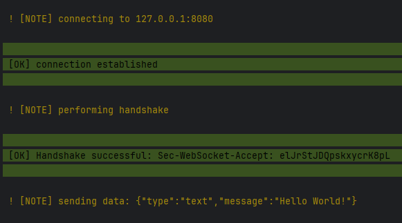

# Symfony Websocket Server Bundle
Websocket Server Bundle for Symfony 7.1

## installation

checkout library
`composer req snoke/symfony-websocket`

modify `config/packages/snoke_websocket.yaml`:
````yml
snoke_websocket:
    context:
        tls:
            local_cert: 'path/to/server.pem'
            local_pk: 'path/to/private.key'
            allow_self_signed: true
            verify_peer: false
````

if you do not want to use TLS:
````yml
snoke_websocket:
    context: []
````
note that websockets without TLS only work on localhost (tho you can still use Stunnel to wrap them into a TLS Connection)

## getting started
### Starting the WebSocket Server

Use the Symfony console command to start the WebSocket server

`php bin/console websocket:start`

You can optionally specify the IP address and port:

`php bin/console websocket:start --ip=127.0.0.1 --port=9000`


### testing the server

you can connect and send a message to your websocket server with following command:

`php bin/console websocket:test`



### Registering Event Listeners

to react to WebSocket events, create your own listeners.

```php
use Snoke\Websocket\Event\RequestReceived;
use Symfony\Component\EventDispatcher\Attribute\AsEventListener;

#[AsEventListener(event: RequestReceived::class, method: 'onRequestReceived')]
final class MessageListener
{
    public function onRequestReceived(RequestReceived $event): void
    {
        $connection = $event->getConnection();
        $connection->send("Salutations, intergalactic sphere!");
    }
}
```
test again with `php bin/console websocket:test`


### Mapping Users
the ConnectionWrapper contains getter and setter to match a connection with a Symfony UserInterface
```php
namespace App\EventListener;

use App\Security\Authenticator;
use Snoke\Websocket\Event\RequestReceived;
use Symfony\Component\Serializer\SerializerInterface;
use Symfony\Component\EventDispatcher\Attribute\AsEventListener;

#[AsEventListener(event: RequestReceived::class, method: 'onRequestReceived')]
final class AuthListener
{
    public function __construct(
        private readonly Authenticator,
        private readonly SerializerInterface
    ) {}
    
    public function onRequestReceived(RequestReceived $event): void
    {
        $request = $event->getRequest();
        $connection = $event->getConnection();
        if ($request['type'] === 'auth') {
            $payload = $request['payload'];
            $user = $this->authenticator->authenticate($payload['identifier'],$payload['password']);
            $connection->setUser($user);
            $connection->send($serializer->serialize($user, 'json'));
        }
    }
}
```

### Broadcasting
you can access all connections in the Listeners through the event
```php
foreach($event->getConnections() as $connection) {
    $connection->send($message);
}
```

### Available Events
- ServerStarted: Triggered when the server is started
- ConnectionOpened: Triggered when a new connection is established.
- RequestReceived: Triggered when a message is received.
- ConnectionClosed: Triggered when a connection is closed.
- Error: Triggered when an error occurs.
